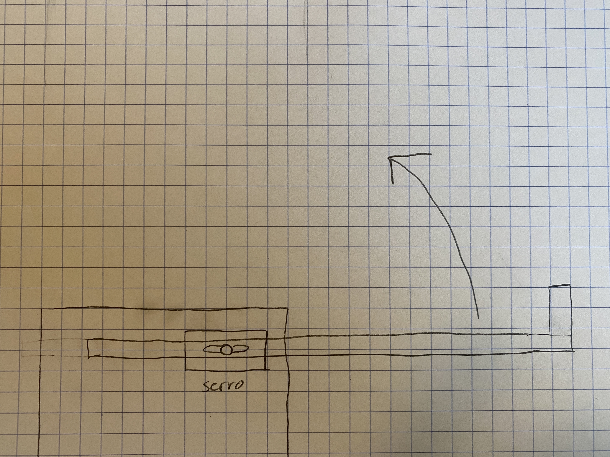
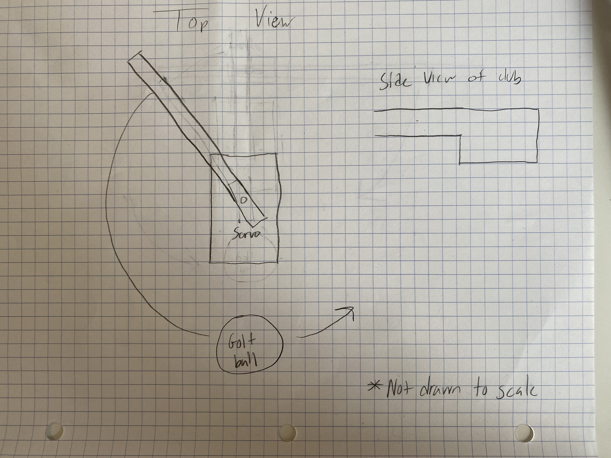

# Planning

## Problem
Playing Spikeball during the Covid-19 pandemic has been hard since it requires you to be in close proximity to other people. Our solution to this problem is to create a Spikeball setter. It will hit the ball up to you, so you can continue practicing your best shots!

## Resources
Our resources include Onshape, a MetroExpress board, a servo, wires, and a breadboard.

## Constraints
The servo may not be strong enough to sufficiently hit the ball, but we will test this after our design has been made. We may have trouble printing our pieces at the Sigma Lab due to Covid-19 restraints and us not being there.

## Solutions
Our CAD designed arm must be light so the servo can lift it and hit the ball. We hope to finish our pieces on the early side to give Dr. Shields ample time to print them.

## Design Concept
We are not exactly sure what our setter should look like to optimizie its hitting ability at this point, but once we create an initial design in OnShape we will update this design section with new images.

## Updated Plan
We are now going to make a golf ball putter since the servo will not be able to set a spikeball. The idea stays generally the same as do the contrainsts. We are still worried about the weight.

This is our new design.

## Schedule

| Week | Goal |
| ---- | ---- |
| Week of 1/25 | Finish planning and create milestones |
| Week of 2/1 | Rough draft of design in Onshape |
| Week of 2/8 | Revised draft of design + assembly |
| Week of 2/15 | Create tentative (untested) final model of arm |
| Week of 2/22 | Write code for the arm |
| Week of 3/1 | Revise code for the arm |
| Week of 3/8 | (If available) Print parts and test code OR (if not available) finalize design and code to demonstrate how arm would work |
| Week of 3/15 | Make any necessary adjustments and create final product |
